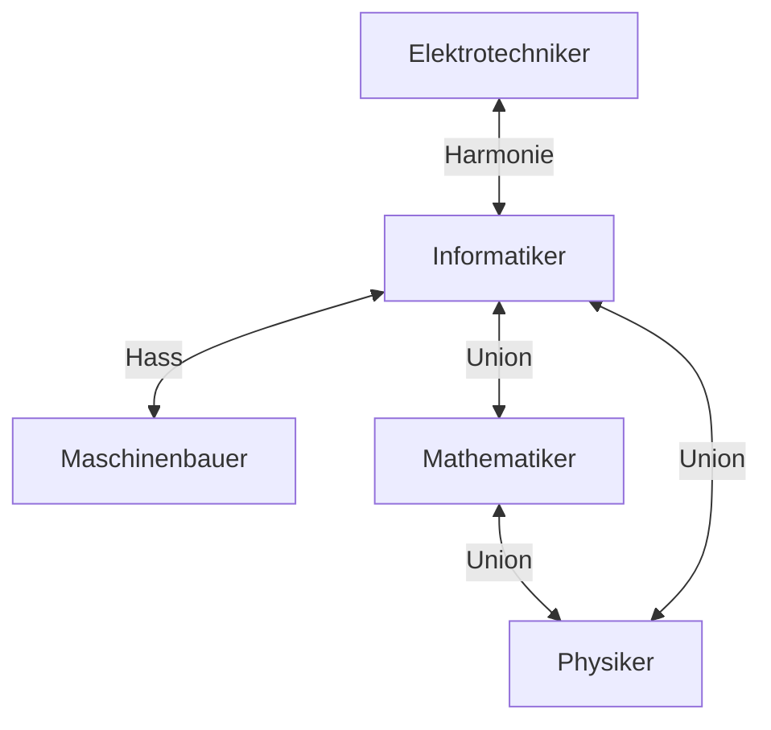

# RWTH FIELD MANUAL

## Table of Contents

1. [Einleitung](#einleitung)
2. [Das Karman Tor](#das-karman-tor)
3. [Der Bib-wichser](#der-bib-wichser)
4. [Sultans Of Kebap](#sultans-of-kebap)
5. [Link](#link)
6. [Thomas Gottschalk](#thomas-gottschalk)
7. [Mensen](#mensen)
8. [Rektor](#rektor)
9. [Nahrung](#nahrung)
10. [Allianzen](#allianzen)
11. [Unterhaltung](#unterhaltung)

[Webseiten](#webseiten)

## Einleitung
___

Dieses Handbuch soll euch helfen, die RWTH Aachen zu überleben. Es ist eine Sammlung von Tipps und Tricks, die euch das Leben an der Uni erleichtern sollen. Es ist in verschiedene Kapitel unterteilt, die euch helfen sollen, euch in der Uni zurechtzufinden.  
In diesem kleinen Guide findet ihr sowohl die Qualitäten Aachens, als auch RWTH-Wertevorstellungen. 

Damit ihr wisst, was euch erwarten wird, ist hier ein Vorgeschmack auf euer Studienerlebnis: [Warum die RWTH anders als andere Unis ist](https://www.youtube.com/watch?v=gxB3h2836TM)

So, du bist also an der RWTH Aachen. Herzlichen Glückwunsch! Du bist im Begriff dein Leben zu ruinieren. Aber keine Sorge, wir sind hier, um dir bei dem Vorhaben zu helfen. Dieses Handbuch soll dir helfen, die RWTH Aachen zu überleben.  
Studiengangspezifische Informationen findet ihr hier:

- [Informatik](Studiengänge/Informatik.md)

## Das Karman Tor
___

Es gibt einige Regeln an der RWTH, die ihr nie brechen solltet. Eine davon ist das Karma Tor. Das Karman Tor ist ein Tor, das sich in der Nähe des Super Cs und dem Hauptgebäude befindet. Es ist ein Tor, das ihr niemals durchqueren solltet. Falls ihr es doch tut, werdet ihr der Legende nach eine Reihe an möglichen Schicksalen erleiden. Der Legende nach reicht die Strafe von dem Nichtbestehen der nächsten Prüfung über den Abbruch des Studiums bis hin zur Tatsache, dass ihr nie die Liebe eures Lebens finden werdet.

Sofern ihr also nicht auf der Suche nach einem Fluch seid, solltet ihr das Karman Tor meiden. Glücklicherweise gibt es eine Möglichkeit, das Karman Tor zu umgehen. Ihr könnt das Karman Tor umgehen, indem ihr den Weg über den Templergraben nehmt. So könnt ihr sicher sein, dass ihr nicht verflucht werdet. Außerdem führt im Augenblick eine Baustelle direkt am Tor vorbei, sodass ihr das Tor auch einfach umgehen könnt.

## Der Bib-wichser
___

Vor einigen Jahren gab es an der RWTH einen Studenten, der sich den Namen "Bib-wichser" verdient hat. Er hat sich diesen Namen gegeben, weil er in der Bibliothek der RWTH Aachen masturbiert hat. Dieser Student ist mittlerweile nicht mehr an der RWTH, aber sein Geist lebt weiter. Der Bib-wichser ist ein Symbol für die Verzweiflung, die manchmal an der RWTH herrscht. Er ist ein Symbol für die Einsamkeit und die abgef*ckten Leute, die hier unter uns weilen.  
TODO

## Sultans Of Kebap
___

"Sultans Of Kebap" ist eine Imbisskette, welche **unter allen Umständen** zu boykottieren ist. Als die Imbissbude in der Pontstraße eröffnet wurde, wurde allen Studenten ein kostenloser Döner versprochen. Als die Studenten jedoch ankamen, um ihren Döner abzuholen, wurden sie von den Betreibern der Imbissbude verpflichtet für den Döner zu zahlen. Dies ist ein Verstoß gegen die Ehre der Studenten und sollte nicht toleriert werden.
Als Studierende sind arm und wir haben das Recht auf einen kostenlosen Döner. Boykottiert "Sultans Of Kebap" und zeigt ihnen, dass sie nicht mit uns machen können, was sie wollen. Seither spürt die Filiale in der Pontstraße den Zorn von Generationen von Studierenden.

Wir sind Studierende.
Wir vergessen nicht.
Wir vergeben nicht.
Erwartet uns.
BOYKOTTIERT "SULTANS OF KEBAP"!
und unterstützt die [kleinen Imbissbuden](#nahrung) in Aachen.

## Link
___

Wir als Aachener sind stolz darauf eine der besten Unis in Deutschland zu haben. Aber so richtig stolz sind wir auf unseren Link aus "The Legend of Zelda". Link ist eine Legende. Er streift durch die Straßen Aachens und ist immer auf der Suche nach neuen Abenteuern. Wenn ihr aufmerksam seid und Glück habt, könnt ihr ihn vielleicht auch mal sehen.

instagram @Linkaachen  
Youtube zeldaachen  
Twitch Zeldaaachen  

## Thomas Gottschalk
___
Aachen ist voll von Thomas Gottschalk. Er ist überall. Er ist an Straßenschildern, in den Gebäuden und in den Herzen der Menschen.  
Außerdem hat ein Team von ausgebildeten und kompetenten Experten im Zuge einer streng geheimen strategischen Operation Thomas Gottschalks Gesicht auf der Unterseite des Super Cs befestigt. Dies war nur durch ausgeklügelte Techniken und dem Einsatz einer Drohne möglich.

## Mensen
___

Die offiziell beste Mensa in Aachen ist die Mensa Academica. Hier gibt es den Klassiker, Vegetarisch und das Tellergericht. Außerdem gibt es hier Wok, die Burgerbar, die Salatbar und die Pizza.

Falls ihr in der vorlesungsfreien Zeit in Aachen seid, solltet ihr unbedingt das Bistro unter dem Hauptgebäude besuchen. Diese Mensa hat länger geöffnet.

Insbesondere wird angemerkt, dass die Mensa Ahornstraße zu meiden ist.

## Rektor
___

Niemand kennt Rüdigers Nachnamen. Er ist der Rektor der RWTH und wurde noch nie mit Gru aus "Ich einfach unverbesserlich" in einem Raum gesehen. Niemand weiß, woher er kommt oder was er macht. Er ist ein Mysterium. Ein Mysterium, das wir alle lieben.

## Nahrung
___

### Streuselbrötchen

Die Streuselbrötchen in Aachen sind legendär. Wir verfolgen unerbittlich die Mission, das Streuselbrötchen zu Aachens Wahrzeichen zu machen.  
Die besten Streuselbrötchen gibt es bei der Bäckerei Moss.

### Campuspizza

Da man als Studierender in Aachen weder einen Lebenserhaltungstrieb, noch die Kompentenz zum Kochen besitzt, ist eine Anlaufstelle des Vertrauens unerlässlich. Hier kommt die Campuspizza ins Spiel.  
Die Campuspizza ist eine türkische Imbissbude, welche vorgibt italienisch zu sein. Sie befindet sich in der Nähe der Mensa Academica. Hier werden mit Sicherheit keine Steuern hinterzogen, weshalb man für etwa 4€ eine Pizza bekommt, die nach Belieben mit allerlei Kriegsverbrechen belegt werden kann.  
Darunter zählen unter anderem: Ei, Hackfleisch, Sauce hollandaise, Sucuk und Ananas, aber auch die klassischen Beläge wie Salami, Schinken, Thunfisch, Paprika, Mozzarella, Weichkäse und Tomaten.

### Schnitzeldienstag!!!

Das wöchentliche Highlight eines jeden Studierenden ist der Schnitzeldienstag. Hierbei handelt es sich um ein Angebot der aachener [Mensen](#mensen). Für 3,20 € bekommt man ein Schnitzel mit Beilage und Sauce. Hierbei sei angemerkt, dass die einzig legitime Beilage Pommes sind. Alles andere ist eine Beleidigung für das Schnitzel.

### Waffelmittwoch

Der Waffelmittwoch ist ein weiteres Highlight der Mensen. Hierbei handelt es sich um ein Angebot der aachener [Mensen](#mensen). In den Genuss von Waffeln kommt man jeden ersten Mittwoch im Monat.

### Sultans Of Kebap

Aufgrund der [Vorfälle](#sultans-of-kebap) in der Pontstraße ist es wichtig, dass dort **unter keinen Umständen** gegessen wird.

### Sowieso

Wer in Aachens abgewrackteste Kneipe gehen will, sollte ins Sowieso gehen. Hier gibt es das volle Programm: Die Heizung ist kaputt, die Wände sind dreckig und mit Graffiti beschmiert und bröckeln ab. Die Tische sind wackelig und kleben. Wer über eine Feuerleiter die Toilette erreichen will ist hier genau richtig.  
Alles in allem ist das Sowieso sehr empfehlenswert und das Personal ist freundlich.

### Pontgrill

Der Pontgrill ist eine Imbissbude in der Pontstraße. Der Dönermann deines Vertrauens.  
Das Essen ist immer "Lecker oder sehr lecker".

### Dat Frittebüdje TODO

Wer nachts um 04:00 noch irgendwas essen will hat hier die perfekte Anlaufstelle gefunden. Der Verfasser wurde dank des feinen Etablissements am oberen Ende der Pontstraße schon mehrfach vor dem Hungertod bewahrt und möchte insbesondere das Baklava zu einem unschlagbaren Preis von 1 € empfehlen.

## Allianzen

## Unterhaltung

Als Student hätte man ja eigentlich genug Zeit, um sich mit den wichtigen Dingen des Lebens zu beschäftigen.  
Aber wenn man vor der Wahl steht, um 08:30 in der Vorlesung zu sitzen oder sich die neueste Folge von "The Mandalorian" anzusehen, dann ist die Wahl doch eigentlich klar, oder?  
Hier sind ein paar Tipps, wie ihr euch möglichst effizient von euren Pflichten ablenken könnt:

- [Reddit](https://www.reddit.com/r/RWTH_memes/)
- [Instagram](https://www.instagram.com/acbushofmemes/?hl=de)

### Hall of Fame

In der Hall of Fame findet ihr die Crème de la Crème der RWTH Memes.  
Diese Videos muss man als Student kennen:

- https://www.youtube.com/watch?v=NOtLb34Osl0
- https://www.youtube.com/watch?v=jE_C-eV8CmQ
- https://www.youtube.com/watch?v=Xh33K-s1CsU
- https://www.youtube.com/watch?v=Tso_5ks1PT8
- https://www.youtube.com/watch?v=OGQSOAWufUQ
- https://www.youtube.com/watch?v=601IDQT9BtM
- https://www.youtube.com/watch?v=gxB3h2836TM
- https://www.youtube.com/watch?v=v92lydUKHrM
- https://www.youtube.com/watch?v=EWGPKGEDBwI
- https://www.youtube.com/watch?v=2HLraHPPyDc

### Partyleben

---
- [**Maschiparty**](https://fsmb.rwth-aachen.de/veranstaltungen/maschiparty/)  
  Die Maschiparty ist eine der größten Partys an der RWTH. Hier treffen sich Studierende aus allen Fachbereichen, um gemeinsam zu feiern.  
  Die Maschiparty findet einmal im Jahr statt und ist ein absolutes Muss für jeden Studierenden.
---
- [**Eishockey**](https://hochschulsport.rwth-aachen.de/cms/hsz/events/~kkti/eishockey-uni-cup/)  
  Der Eishockey Uni Cup ist ein jährliches Event, bei dem die Maschis gegen die Etis und Medis antreten.  
  Allerdings ist Erstis der Ticketverkauf nicht gestattet und wird als respektlos angesehen.  Ihr seid jedoch herzlich eingeladen, die Veranstaltung zu besuchen, wenn ihr in den höheren Semestern seid.
---
- [**SAP**]()  
  Die SAP - oder auch Semesteranfangsparty - ist eine sehr empfehlenswerte jährliche Veranstaltung um die das Semester gebührend zu beginnen.  
  Alles, was ihr dazu wissen müsst, ist, dass ihr euch auf eine lange Nacht einstellen solltet.
---
- [**Nacht der Professoren**]()  
  Die Nacht der Professoren ist ein Muss für jeden, der seinen Professor mal in einem anderen Licht sehen will.  
  Hier zeigen unsere Profs, wie gut ihre Künste als DJ sind und ob sie nicht doch ein bisschen mehr drauf haben, als nur Vorlesungen zu halten.
  Wer weiß, vielleicht hat ja der ein oder andere Professor seine wahre Berufung als DJ verfehlt.
---
- [**Bierbachelor**]()  
  Der Bierbachelor ist ein jährliches Event, bei dem die Studierenden der RWTH Aachen die Möglichkeit haben innerhalb einer Nacht ihren Bachelor zu machen.  
  Naja, zumindest im Biertrinken.  
  Hierfür musst du dein Können in verschiedenen aachener Kneipen unter Beweis stellen und zeigen, dass du ein echter Aachener bist.  
  Im Folgejahr kannst du dann am Biermaster teilnehmen, bis du irgendwann promovierst und zum Bierdoktor wirst.
---

## Webseiten

### Offizielle Webseiten

- [RWTHmoodle](https://moodle.rwth-aachen.de/)
- [RWTHonline](https://online.rwth-aachen.de/)
- [RWTHmail](https://mail.rwth-aachen.de/)

### Inoffizielle Webseiten

- [RWTHoffline](https://offline.rwth-aachen.de/)
- [Panikzettel](https://panikzettel.philworld.de)
- [HTWR]
- [die Erlösung](https://bit.ly/rwtherlösung)
- [Schrank]
- [Skriptesammlung](https://s-inf.de)

TODO:  
Links ergänzen

MaPhIns, 
Mechanik 3, HöMa Just don't
AfI bei Torrilhon oder so